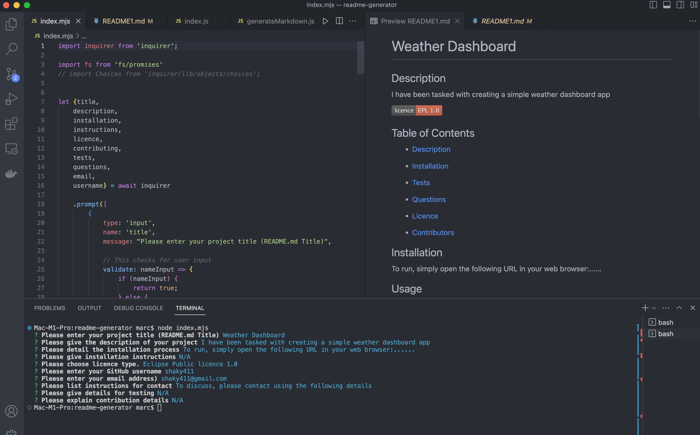

# Professional README Generator


## The Task:

* I have been tasked with creating a professional README generator. The application will run in the terminal.

* This app features dynamically updated information.

**Instructions**

* Create a README generator that displays the following sections:

    * The title of my project 
    * Sections entitled:
      * Description 
      * Table of Contents 
      * Installation 
      * Usage 
      * License 
      * Contributing 
      * Tests 
      * Questions

## Installation

To application will be invoked by using the following command:

```bash
node index.mjs
```

## Usage


## Screenshots



## Application Video Walkthrough

https://www.loom.com/share/ecf476cfa0564139a7836612f663cd10

## Credits

N/A

## License

* _This application has the MIT Licence_
For more info, please go to the [licence description](https://opensource.org/license/mit/)